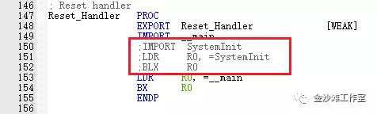
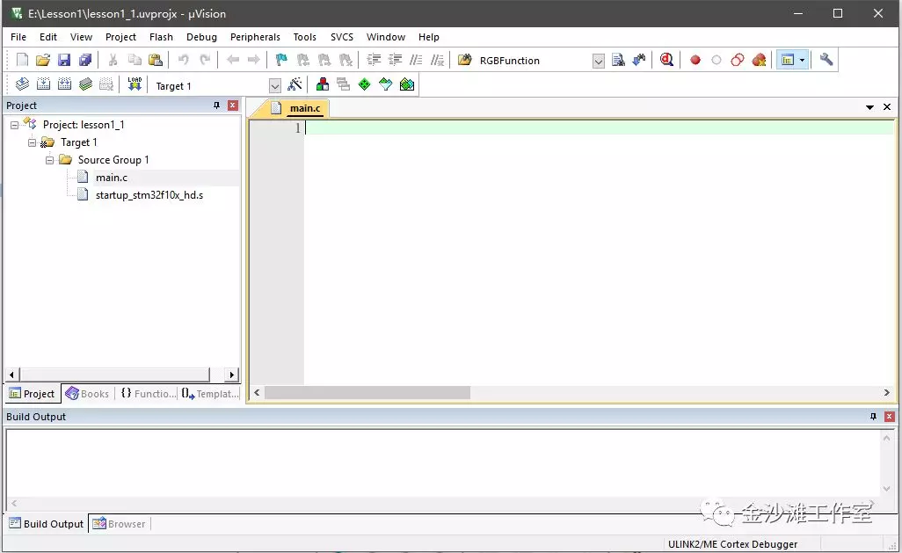
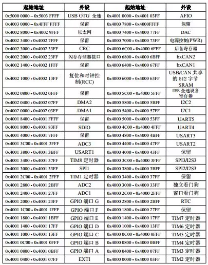
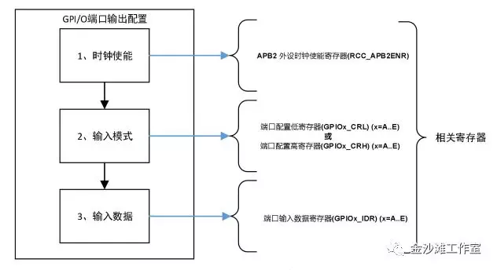
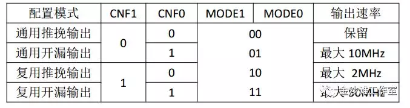
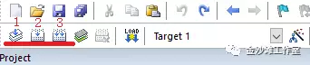
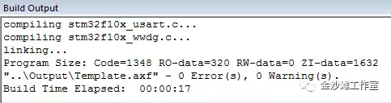

# 点亮LED  

Cortex-M3(简称“CM3”)处理器内核是单片机的中央处理单元，由ARM授权后，厂家添加自己的外设。  

  

注：这个图片使用Hbuilder看不到效果，添加图片的语法是正确的，验证效果在网页上可以看的到。  

对于单片机用户来说，单片机提供的三大资源分别是程序存储空间、数据存储空间和特殊功能寄存器。顾名思义，程序存储空间是用来存储用户写的代码的，数据存储空间用来存储程序运行过程中需要的以及产生的数据，特殊功能寄存器用来控制单片机执行各种不同的功能，用户通过读写特殊功能寄存器让单片机执行不同的功能。STM32F103ZE这款单片机，有512K字节的FLASH（程序存储空间），64K字节的静态SRAM（数据存储空间）。  

## 单片机最小系统  
单片机最小系统，也叫做单片机最小应用系统，是指用最小的原件组成单片机可以工作的最小系统。电源、晶振和复位电路是单片机系统的三要素。  

## 添加启动文件  
“startup_stm32f10x_hd.s”，点击“Add”，将其添加到工程中来。文本添加完成后，还需要修改一下启动文件。如图1-21所示，启动文件150~152这三行代码如果未注释掉，则使用分号“;”注释掉，不执行这三条语句，后面使用库函数开发时才会使用。  
  
修改完成后在main函数中编写程序代码，如下图：  
   

## 程序代码的编写  
### 单片机寄存器的访问  
	单片机内部有许许多多的特殊功能寄存器，控制着单片机的各个模块，完成了单片机强大的功能。比如要把一个单片机的引脚设置成高电平，只需要通过编程将这个引脚对应的寄存器设置成相应的数值，单片机就可以自动输出高电平。单片机内部的寄存器非常多，为了管理这些寄存器，就给他们分配了许多个房间，每个房间都有个房间号，即地址。编写程序通过访问这个地址，设置对应地址的特殊功能寄存器来完成单片机强大的功能，也叫做地址映射。  
	学习51单片机的时候，由于51单片机内部结构的特殊性，RAM地址和寄存器地址有重复的区间，所以映射寄存器用的是sfr这个关键字，不能对寄存器地址直接操作。比如sfr P0= 0x80; P0=0x01;表达的意思是将0x01赋值给0x80这个地址对应的寄存器。对于其他类型的单片机的寄存器操作，大多数可以对寄存器地址直接操作。比如对STM32的寄存器操作*(unsigned int *)0x4001100C = 0x01；表达的意思就是将0x01赋值给0x4001100C这个地址对应的寄存器。0x4001100C是个地址，使用(unsigned int *)强制转换成指针，前边再加*相当于访问这个指针指向的内容，最终对这个内容进行赋值。  
### 寄存器地址的分配  
一栋99层的大楼，有很多个房间，如何区分？比如0312这个房间，通常认为03是楼层，3楼的第1个房间的房间号就是0301，那0312这个房间号代表的就是第3层的第12个房间。STM32的寄存器也分成了很多个组，每一组都有一个起始地址，也称之为基地址，回到楼层的例子上，基地址就相当于0300(与现实的房间号不同的是MCU从0开始计数)；每一组里边又包含多个寄存器，每个寄存器都相对基地址存在地址偏移，也称之为偏移地址，12就是房间0312相对0300的偏移地址。STM32F103的寄存器基地址和偏移地址都可以从《STM32中文参考手册》“2.3节 存储器映像”查阅到，寄存器起始地址如表1-2所示，这个表格了解即可，用到随时查阅。  
   
STM32F103的IO口统称为GPIO(General Purpose Input Output通用输入/输出)，这是单片机一个重要的外设。STM32F103ZE的IO口多达112个，为了方便管理这么多IO口，将其分为A、B、C、D、E、F、G一共7组，每一组有16个IO口，同样也产生了7组管理GPIO口的寄存器，每一组寄存器都有基地址，每一个寄存器都有其相对基地址的偏移地址，这么多寄存器负责管理和控制单片机GPIO口的输入输出模式和数据。  
### STM32的GPIO端口配置流程  
一共三个步骤：配置端口时钟、配置端口模式、配置输出数据。如下图所示。  
  

配置端口模式。STM32的IO口模式有8种。分别是 **浮空输入、上拉输入、下拉输入、模拟输入、开漏输出、推挽输出、推挽式复用功能、开漏复用功能**，本节先介绍输出模式。如表1-3所示，其中CNF1和CNF0两位用来表示模式，MODE1和MODE0用来表示输出速率。  
当模式为输入时，默认MODE1和MODE0是00；当模式为输出时，MODE1和MODE0的三种组合表示三种不同的最大输出速率，**注意这里的速率指的是I/O口驱动电路的响应速度而不是I/O口输出信号的速度**。而CNF1和CNF0的组合代表了4种不同的输出模式。
  

## 编译下载  
程序编写完成后，鼠标点击图中下划线标注的快捷图标。

1、Translate，仅编译当前文件，不生成最终程序文件；

2、Build，构建生成，编译所有已修改文件，生成最终程序文件；

3、Rebuild，重新构建生成，重新编译所有文件，生成最终程序文件。

通常推荐使用第2个，可以有效节省编译时间。  
   
编译完成后，在Keil下方Output窗口会出现相应的提示，如图1-35，Program Size: Code=1348的意思是代码占用了1348个字节的程序存储空间。RO-data（Read Only）是只读常量的大小，RW-data（Read/Write）是已初始化的可读写变量的大小，ZI-data（Zero Initialize）未初始化的可读写变量的大小。

当提示“0 Error(s), 0 warning(s)”表示的程序没有错误和警告，如果出现有错误和警告提示的话，就是Error和warning不是0，那么就要对程序进行检查，找出问题，解决好了再重新编译。  
   
到此为止，程序就编译好了。连接好下载器，点击图1-36所示的按钮或者点击“Flash->Download”将代码下载到单片机中，即可完成程序下载，同时也完成了点亮LED小灯实验。  
  
